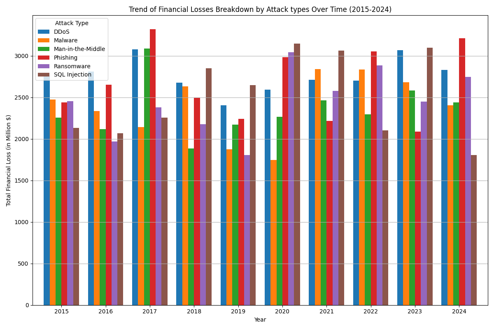
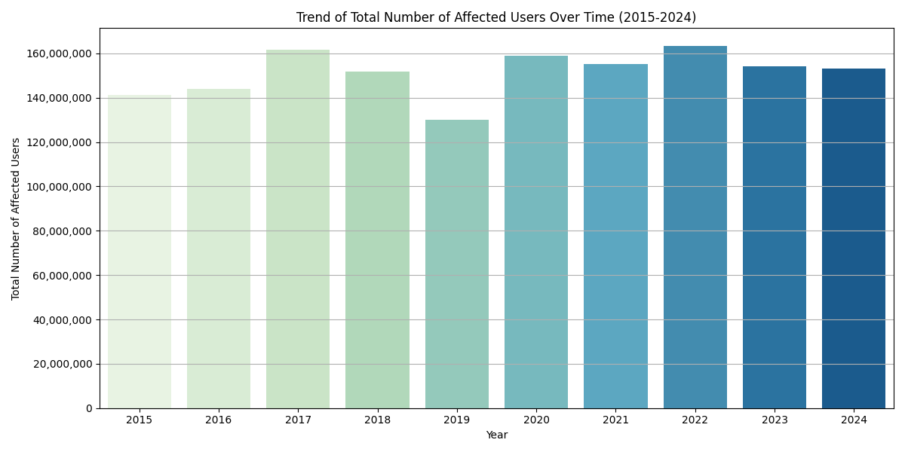

- [Setup](#org4b3c0e0)
  - [Import Packages](#orgee3592b)
  - [Load data](#org295b770)
- [Trend Analysis](#orgea18493)
  - [Financial Losses](#org33e3de7)
    - [Overall](#orgad1a8e8)
    - [Breakdown by Attack types](#org2fd0c50)
    - [Breakdown by Target Industries](#orgc68ec26)
    - [Breakdown by Vulnerabilities](#org9f486e1)
  - [Number of Affected Users](#orgd8b9c64)
    - [Overall](#orgad795ae)
    - [Breakdown by Attack types](#orge6be380)
    - [Breakdown by Target Industries](#orga236d69)
    - [Breakdown by Vulnerabilities](#org50b863b)
- [Geographical Analysis](#org3e0c205)
  - [Financial Losses](#org1435948)
    - [Overall](#org4c25a62)
  - [Number of Affected Users](#orgf2dfbc9)
    - [Overall](#org888dfa6)
- [Financial Impact Analysis](#org609c474)
- [Industry Analysis](#org2b76c1f)
- [Vulnerability Analysis](#org9b89400)
- [User Impact Analysis](#org8583ff2)
- [Response Time Analysis](#org8abbd15)
- [Defensive Mechanism Effectiveness](#org701383b)


<a id="org4b3c0e0"></a>

# Setup


<a id="orgee3592b"></a>

## Import Packages

```python
import pandas as pd
import numpy as np
import matplotlib.pyplot as plt
from matplotlib.ticker import FuncFormatter
import seaborn as sns
```


<a id="org295b770"></a>

## Load data

```python
pd.set_option('display.max_columns', 50, 'display.width', 200)
df = pd.read_csv('data/Global_Cybersecurity_Threats_2015-2024.csv')
df.head()
```

```text
|   | Country | Year | Attack Type       | Target Industry    | Financial Loss (in Million $) | Number of Affected Users | Attack Source | Security Vulnerability Type | Defense Mechanism Used | Incident Resolution Time (in Hours) |
|---+---------+------+-------------------+--------------------+-------------------------------+--------------------------+---------------+-----------------------------+------------------------+-------------------------------------|
| 0 | China   | 2019 | Phishing          | Education          |                         80.53 |                   773169 | Hacker Group  | Unpatched Software          | VPN                    |                                  63 |
| 1 | China   | 2019 | Ransomware        | Retail             |                         62.19 |                   295961 | Hacker Group  | Unpatched Software          | Firewall               |                                  71 |
| 2 | India   | 2017 | Man-in-the-Middle | IT                 |                         38.65 |                   605895 | Hacker Group  | Weak Passwords              | VPN                    |                                  20 |
| 3 | UK      | 2024 | Ransomware        | Telecommunications |                         41.44 |                   659320 | Nation-state  | Social Engineering          | AI-based Detection     |                                   7 |
| 4 | Germany | 2018 | Man-in-the-Middle | IT                 |                         74.41 |                   810682 | Insider       | Social Engineering          | VPN                    |                                  68 |
```


<a id="orgea18493"></a>

# Trend Analysis


<a id="org33e3de7"></a>

## Financial Losses


<a id="orgad1a8e8"></a>

### Overall

```python
trend_df = df.groupby('Year')['Financial Loss (in Million $)'].sum()

plt.figure(figsize=(12, 6))
sns.barplot(x=trend_df.index,y=trend_df, palette="GnBu")

plt.title('Trend of Total Financial Losses Over Time (2015-2024)')
plt.xlabel('Year')
plt.ylabel('Total Financial Loss (in Million $)')
plt.grid(axis='y')

plt.tight_layout()
#plt.show()

```


<a id="org2fd0c50"></a>

### Breakdown by Attack types

```python
# Group by Year and Attack Type, summing financial losses
trend_df = df.groupby(['Year', 'Attack Type'])['Financial Loss (in Million $)'].sum().unstack(fill_value=0)

# Plotting the data as a bar chart
trend_df.plot(kind='bar', figsize=(12, 8), width=0.8)

plt.title('Trend of Financial Losses Breakdown by Attack types Over Time (2015-2024)')
plt.xlabel('Year')
plt.ylabel('Total Financial Loss (in Million $)')
plt.xticks(rotation=0)  # Keep x-axis labels horizontal
plt.legend(title='Attack Type')
plt.grid(axis='y')
plt.tight_layout()
plt.show()
```




<a id="orgc68ec26"></a>

### Breakdown by Target Industries

```python
# Group by Year and Target Industry, summing financial losses
trend_df = df.groupby(['Year', 'Target Industry'])['Financial Loss (in Million $)'].sum().unstack(fill_value=0)

# Plotting the data as a bar chart
trend_df.plot(kind='bar', figsize=(12, 8), width=0.8)

plt.title('Trend of Financial Losses Breakdown by Target Industries Over Time (2015-2024)')
plt.xlabel('Year')
plt.ylabel('Total Financial Loss (in Million $)')
plt.xticks(rotation=0)  # Keep x-axis labels horizontal
plt.legend(title='Target Industry')
plt.grid(axis='y')
plt.tight_layout()
plt.show()
```


<a id="org9f486e1"></a>

### Breakdown by Vulnerabilities

```python
# Group by Year and Security Vulnerability Type, summing financial losses
vulnerability_df = df.groupby(['Year', 'Security Vulnerability Type'])['Financial Loss (in Million $)'].sum().unstack(fill_value=0)

# Plotting the data as a bar chart
vulnerability_df.plot(kind='bar', figsize=(12, 8), width=0.8)

plt.title('Financial Losses Due to Vulnerabilities Over Time (2015-2024)')
plt.xlabel('Year')
plt.ylabel('Total Financial Loss (in Million $)')
plt.xticks(rotation=0)  # Keep x-axis labels horizontal
plt.legend(title='Vulnerability Type')
plt.grid(axis='y')
plt.tight_layout()
plt.show()
```


<a id="orgd8b9c64"></a>

## Number of Affected Users


<a id="orgad795ae"></a>

### Overall

```python
trend_df = df.groupby('Year')['Number of Affected Users'].sum()

plt.figure(figsize=(12, 6))
sns.barplot(x=trend_df.index,y=trend_df, palette="GnBu")

plt.title('Trend of Total Number of Affected Users Over Time (2015-2024)')
plt.xlabel('Year')
plt.ylabel('Total Number of Affected Users')
plt.grid(axis='y')

# Apply number formatting
plt.gca().yaxis.set_major_formatter(FuncFormatter(lambda x, _: f'{int(x):,}'))

plt.tight_layout()
plt.show()
```




<a id="orge6be380"></a>

### Breakdown by Attack types

```python
trend_df = df.groupby(['Year', 'Attack Type'])['Number of Affected Users'].sum().unstack(fill_value=0)

# Plotting the data as a bar chart
trend_df.plot(kind='bar', stacked=True, figsize=(12, 8), width=0.8)

plt.title('Trend of Number of Affected Users Breakdown by Attack types Over Time (2015-2024)')
plt.xlabel('Year')
plt.ylabel('Total Number of Affected Users')
plt.xticks(rotation=0)  # Keep x-axis labels horizontal
plt.legend(title='Attack Type')
plt.grid(axis='y')
plt.gca().yaxis.set_major_formatter(FuncFormatter(lambda x, _: f'{int(x):,}')) # Apply number formatting
plt.tight_layout()
plt.show()
```


<a id="orga236d69"></a>

### Breakdown by Target Industries

```python

trend_df = df.groupby(['Year', 'Target Industry'])['Number of Affected Users'].sum().unstack(fill_value=0)

# Plotting the data as a bar chart
trend_df.plot(kind='bar', stacked=True, figsize=(12, 8), width=0.8)

plt.title('Trend of Number of Affected Users Breakdown by Target Industries Over Time (2015-2024)')
plt.xlabel('Year')
plt.ylabel('Total Number of Affected Users')
plt.xticks(rotation=0)  # Keep x-axis labels horizontal
plt.legend(title='Target Industry')
plt.grid(axis='y')
plt.gca().yaxis.set_major_formatter(FuncFormatter(lambda x, _: f'{int(x):,}')) # Apply number formatting
plt.tight_layout()
plt.show()
```


<a id="org50b863b"></a>

### Breakdown by Vulnerabilities

```python
trend_df = df.groupby(['Year', 'Security Vulnerability Type'])['Number of Affected Users'].sum().unstack(fill_value=0)

# Plotting the data as a bar chart
trend_df.plot(kind='bar', stacked=True, figsize=(12, 8), width=0.8)

plt.title('Trend of Number of Affected Users Breakdown by Vulnerabilities Over Time (2015-2024)')
plt.xlabel('Year')
plt.ylabel('Total Number of Affected Users')
plt.xticks(rotation=0)  # Keep x-axis labels horizontal
plt.legend(title='Security Vulnerability Type')
plt.grid(axis='y')
plt.gca().yaxis.set_major_formatter(FuncFormatter(lambda x, _: f'{int(x):,}')) # Apply number formatting
plt.tight_layout()
plt.show()
```


<a id="org3e0c205"></a>

# Geographical Analysis

-   Compare the frequency and impact of cyberattacks across different countries.
-   Identify which countries are most affected by specific attack types.


<a id="org1435948"></a>

## Financial Losses


<a id="org4c25a62"></a>

### Overall

```python
grouped_df = df.groupby('Country')['Financial Loss (in Million $)'].sum()

# Plotting the pie chart
plt.figure(figsize=(10, 8))
wedges, texts, autotexts = plt.pie(grouped_df, autopct=lambda pct:f"${round(grouped_df.sum()*pct/100):,}M\n({pct:.1f}%)", textprops=dict(color="w"), wedgeprops=dict(width=0.7, edgecolor='w'))
plt.legend(wedges, grouped_df.index, title="Countries", loc="center left", bbox_to_anchor=(1, 0, 0.5, 1))
plt.title('Financial Losses by Country (2015-2024)')
plt.tight_layout()
plt.show()
```


<a id="orgf2dfbc9"></a>

## Number of Affected Users


<a id="org888dfa6"></a>

### Overall

```python
country_df = df.groupby('Country')['Number of Affected Users'].sum()

# Plotting the pie chart
plt.figure(figsize=(10, 8))
wedges, texts, autotexts = plt.pie(country_df, autopct=lambda pct:f"{round(country_df.sum()*pct/100):,}\n({pct:.1f}%)", textprops=dict(color="w"), wedgeprops=dict(width=0.7, edgecolor='w'))
plt.legend(wedges, country_df.index, title="Countries", loc="center left", bbox_to_anchor=(1, 0, 0.5, 1))
plt.title('Number of Affected Users by Country (2015-2024)')
plt.tight_layout()
plt.show()
```


<a id="org609c474"></a>

# Financial Impact Analysis

-   Assess the total financial losses caused by cyberattacks per year or country.
-   Analyze the correlation between attack types and financial losses.


<a id="org2b76c1f"></a>

# Industry Analysis

-   Determine which industries are most frequently targeted by cyberattacks.
-   Assess the impact of attacks on different sectors, such as healthcare, finance, and education.


<a id="org9b89400"></a>

# Vulnerability Analysis

-   Identify common security vulnerabilities exploited in attacks.
-   Analyze the effectiveness of various defense mechanisms used against attacks.


<a id="org8583ff2"></a>

# User Impact Analysis

-   Assess how many users are affected by different attack types or in different countries.
-   Explore the relationship between the number of affected users and financial losses.


<a id="org8abbd15"></a>

# Response Time Analysis

-   Analyze the incident resolution times based on attack types or countries.
-   Identify any patterns in response effectiveness.


<a id="org701383b"></a>

# Defensive Mechanism Effectiveness

-   Evaluate the success rates of different defense mechanisms against various attack types.
