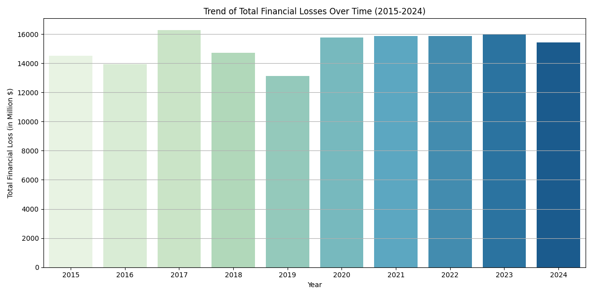

- [Setup](#org6c75616)
  - [Import Packages](#orgbc9ef93)
  - [Load data](#org98dea51)
- [Trend Analysis](#orgdc18d71)
  - [Financial Losses](#orgcef3aac)
    - [Overall](#org738c0b5)
    - [Breakdown by Attack types](#orge0051f1)
    - [Breakdown by Target Industries](#orge53b84a)
    - [Breakdown by Vulnerabilities](#org4aa40ae)
  - [Number of Affected Users](#org0af26ed)
    - [Overall](#org9631d0c)
    - [Breakdown by Attack types](#org479ecf1)
    - [Breakdown by Target Industries](#org600ee54)
    - [Breakdown by Vulnerabilities](#org57e0c9d)
- [Geographical Analysis](#org4bfb128)
- [Financial Impact Analysis](#org3138e51)
- [Industry Analysis](#org9ab8b2b)
- [Vulnerability Analysis](#orge8d78af)
- [User Impact Analysis](#org2fa1888)
- [Response Time Analysis](#orgdaecf07)
- [Defensive Mechanism Effectiveness](#orga283783)


<a id="org6c75616"></a>

# Setup


<a id="orgbc9ef93"></a>

## Import Packages

```python
import pandas as pd
import numpy as np
import matplotlib.pyplot as plt
from matplotlib.ticker import FuncFormatter
import seaborn as sns
```


<a id="org98dea51"></a>

## Load data

```python
pd.set_option('display.max_columns', 50, 'display.width', 200)
df = pd.read_csv('data/Global_Cybersecurity_Threats_2015-2024.csv')
df.head()
```

```text
|   | Country | Year | Attack Type       | Target Industry    | Financial Loss (in Million $) | Number of Affected Users | Attack Source | Security Vulnerability Type | Defense Mechanism Used | Incident Resolution Time (in Hours) |
|---+---------+------+-------------------+--------------------+-------------------------------+--------------------------+---------------+-----------------------------+------------------------+-------------------------------------|
| 0 | China   | 2019 | Phishing          | Education          |                         80.53 |                   773169 | Hacker Group  | Unpatched Software          | VPN                    |                                  63 |
| 1 | China   | 2019 | Ransomware        | Retail             |                         62.19 |                   295961 | Hacker Group  | Unpatched Software          | Firewall               |                                  71 |
| 2 | India   | 2017 | Man-in-the-Middle | IT                 |                         38.65 |                   605895 | Hacker Group  | Weak Passwords              | VPN                    |                                  20 |
| 3 | UK      | 2024 | Ransomware        | Telecommunications |                         41.44 |                   659320 | Nation-state  | Social Engineering          | AI-based Detection     |                                   7 |
| 4 | Germany | 2018 | Man-in-the-Middle | IT                 |                         74.41 |                   810682 | Insider       | Social Engineering          | VPN                    |                                  68 |
```


<a id="orgdc18d71"></a>

# Trend Analysis


<a id="orgcef3aac"></a>

## Financial Losses


<a id="org738c0b5"></a>

### Overall

```python
trend_df = df.groupby('Year')['Financial Loss (in Million $)'].sum()

plt.figure(figsize=(12, 6))
plt.bar(trend_df.index, trend_df, width=0.6)

plt.title('Trend of Total Financial Losses Over Time (2015-2024)')
plt.xlabel('Year')
plt.ylabel('Total Financial Loss (in Million $)')
plt.grid(axis='y')

plt.tight_layout()
plt.show()
```




<a id="orge0051f1"></a>

### Breakdown by Attack types

```python
# Group by Year and Attack Type, summing financial losses
trend_df = df.groupby(['Year', 'Attack Type'])['Financial Loss (in Million $)'].sum().unstack(fill_value=0)

# Plotting the data as a bar chart
trend_df.plot(kind='bar', figsize=(12, 8), width=0.8)

plt.title('Trend of Financial Losses Breakdown by Attack types Over Time (2015-2024)')
plt.xlabel('Year')
plt.ylabel('Total Financial Loss (in Million $)')
plt.xticks(rotation=0)  # Keep x-axis labels horizontal
plt.legend(title='Attack Type')
plt.grid(axis='y')
plt.tight_layout()
plt.show()
```


<a id="orge53b84a"></a>

### Breakdown by Target Industries

```python
# Group by Year and Target Industry, summing financial losses
trend_df = df.groupby(['Year', 'Target Industry'])['Financial Loss (in Million $)'].sum().unstack(fill_value=0)

# Plotting the data as a bar chart
trend_df.plot(kind='bar', figsize=(12, 8), width=0.8)

plt.title('Trend of Financial Losses Breakdown by Target Industries Over Time (2015-2024)')
plt.xlabel('Year')
plt.ylabel('Total Financial Loss (in Million $)')
plt.xticks(rotation=0)  # Keep x-axis labels horizontal
plt.legend(title='Target Industry')
plt.grid(axis='y')
plt.tight_layout()
plt.show()
```


<a id="org4aa40ae"></a>

### Breakdown by Vulnerabilities

```python
# Group by Year and Security Vulnerability Type, summing financial losses
vulnerability_df = df.groupby(['Year', 'Security Vulnerability Type'])['Financial Loss (in Million $)'].sum().unstack(fill_value=0)

# Plotting the data as a bar chart
vulnerability_df.plot(kind='bar', figsize=(12, 8), width=0.8)

plt.title('Financial Losses Due to Vulnerabilities Over Time (2015-2024)')
plt.xlabel('Year')
plt.ylabel('Total Financial Loss (in Million $)')
plt.xticks(rotation=0)  # Keep x-axis labels horizontal
plt.legend(title='Vulnerability Type')
plt.grid(axis='y')
plt.tight_layout()
plt.show()
```


<a id="org0af26ed"></a>

## Number of Affected Users


<a id="org9631d0c"></a>

### Overall

```python
trend_df = df.groupby('Year')['Number of Affected Users'].sum()

plt.figure(figsize=(12, 6))
plt.bar(trend_df.index, trend_df, width=0.6)

plt.title('Trend of Total Number of Affected Users Over Time (2015-2024)')
plt.xlabel('Year')
plt.ylabel('Total Number of Affected Users')
plt.grid(axis='y')

# Apply number formatting
plt.gca().yaxis.set_major_formatter(FuncFormatter(lambda x, _: f'{int(x):,}'))

plt.tight_layout()
plt.show()
```


<a id="org479ecf1"></a>

### Breakdown by Attack types

```python
trend_df = df.groupby(['Year', 'Attack Type'])['Number of Affected Users'].sum().unstack(fill_value=0)

# Plotting the data as a bar chart
trend_df.plot(kind='bar', stacked=True, figsize=(12, 8), width=0.8)

plt.title('Trend of Number of Affected Users Breakdown by Attack types Over Time (2015-2024)')
plt.xlabel('Year')
plt.ylabel('Total Number of Affected Users')
plt.xticks(rotation=0)  # Keep x-axis labels horizontal
plt.legend(title='Attack Type')
plt.grid(axis='y')
plt.gca().yaxis.set_major_formatter(FuncFormatter(lambda x, _: f'{int(x):,}')) # Apply number formatting
plt.tight_layout()
plt.show()
```


<a id="org600ee54"></a>

### Breakdown by Target Industries

```python

trend_df = df.groupby(['Year', 'Target Industry'])['Number of Affected Users'].sum().unstack(fill_value=0)

# Plotting the data as a bar chart
trend_df.plot(kind='bar', stacked=True, figsize=(12, 8), width=0.8)

plt.title('Trend of Number of Affected Users Breakdown by Target Industries Over Time (2015-2024)')
plt.xlabel('Year')
plt.ylabel('Total Number of Affected Users')
plt.xticks(rotation=0)  # Keep x-axis labels horizontal
plt.legend(title='Target Industry')
plt.grid(axis='y')
plt.gca().yaxis.set_major_formatter(FuncFormatter(lambda x, _: f'{int(x):,}')) # Apply number formatting
plt.tight_layout()
plt.show()
```


<a id="org57e0c9d"></a>

### Breakdown by Vulnerabilities

```python
trend_df = df.groupby(['Year', 'Security Vulnerability Type'])['Number of Affected Users'].sum().unstack(fill_value=0)

# Plotting the data as a bar chart
trend_df.plot(kind='bar', stacked=True, figsize=(12, 8), width=0.8)

plt.title('Trend of Number of Affected Users Breakdown by Vulnerabilities Over Time (2015-2024)')
plt.xlabel('Year')
plt.ylabel('Total Number of Affected Users')
plt.xticks(rotation=0)  # Keep x-axis labels horizontal
plt.legend(title='Security Vulnerability Type')
plt.grid(axis='y')
plt.gca().yaxis.set_major_formatter(FuncFormatter(lambda x, _: f'{int(x):,}')) # Apply number formatting
plt.tight_layout()
plt.show()
```


<a id="org4bfb128"></a>

# Geographical Analysis

-   Compare the frequency and impact of cyberattacks across different countries.
-   Identify which countries are most affected by specific attack types.


<a id="org3138e51"></a>

# Financial Impact Analysis

-   Assess the total financial losses caused by cyberattacks per year or country.
-   Analyze the correlation between attack types and financial losses.


<a id="org9ab8b2b"></a>

# Industry Analysis

-   Determine which industries are most frequently targeted by cyberattacks.
-   Assess the impact of attacks on different sectors, such as healthcare, finance, and education.


<a id="orge8d78af"></a>

# Vulnerability Analysis

-   Identify common security vulnerabilities exploited in attacks.
-   Analyze the effectiveness of various defense mechanisms used against attacks.


<a id="org2fa1888"></a>

# User Impact Analysis

-   Assess how many users are affected by different attack types or in different countries.
-   Explore the relationship between the number of affected users and financial losses.


<a id="orgdaecf07"></a>

# Response Time Analysis

-   Analyze the incident resolution times based on attack types or countries.
-   Identify any patterns in response effectiveness.


<a id="orga283783"></a>

# Defensive Mechanism Effectiveness

-   Evaluate the success rates of different defense mechanisms against various attack types.
