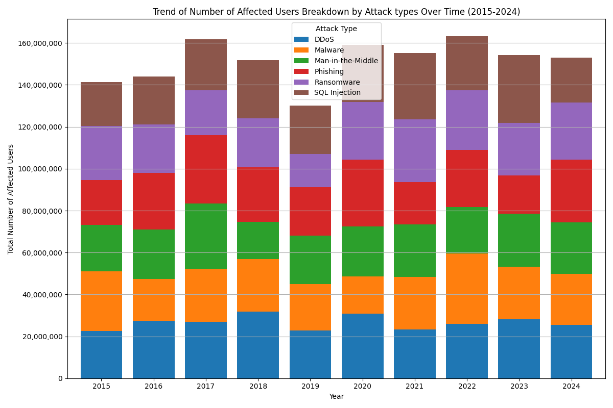
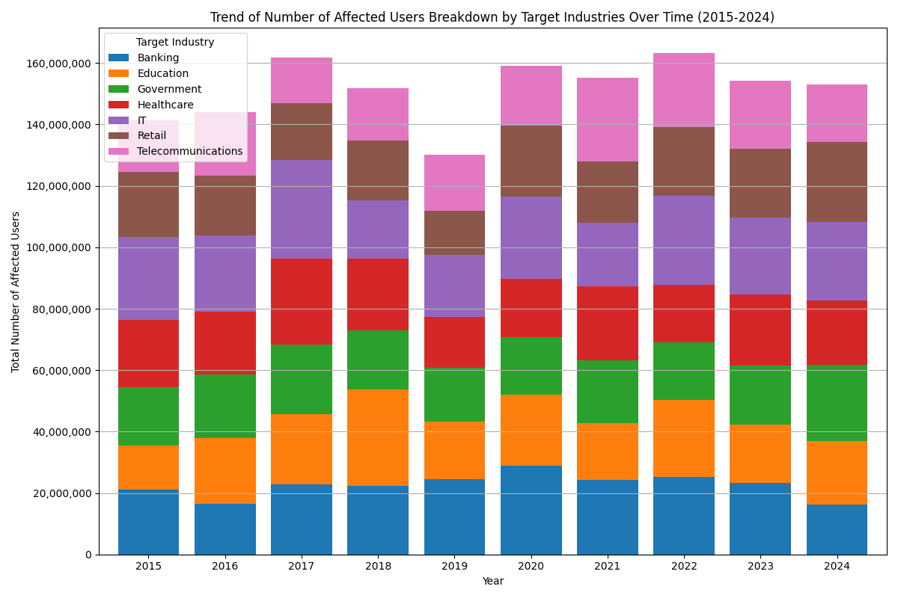

- [Setup](#orgb7cefed)
  - [Import Packages](#org9d63fca)
  - [Load data](#org1b9b29d)
- [Trend Analysis](#org83c8266)
  - [Financial Losses](#org7ff70ba)
    - [Overall](#org888fdc9)
    - [Breakdown by Countries](#org1a74c29)
    - [Breakdown by Attack types](#orgbbf91f6)
    - [Breakdown by Target Industries](#orga50c398)
    - [Breakdown by Vulnerabilities](#orgc952683)
  - [Number of Affected Users](#orgdec50f5)
    - [Overall](#org35a2a4e)
    - [Breakdown by Countries](#org6f6e236)
    - [Breakdown by Attack types](#org980b287)
    - [Breakdown by Target Industries](#orga1b29d4)
    - [Breakdown by Vulnerabilities](#org6aec5d1)
- [Geographical Analysis](#org753ec07)
  - [Financial Losses](#org5475f32)
    - [Overall](#org2afe3e6)
  - [Number of Affected Users](#org489793c)
    - [Overall](#orgc2375e0)
- [Financial Impact Analysis](#org0e10eca)
- [Industry Analysis](#org3921681)
- [Vulnerability Analysis](#org4a5b729)
- [User Impact Analysis](#org924137a)
- [Response Time Analysis](#org2f5f67f)
- [Defensive Mechanism Effectiveness](#orgc0bb888)


<a id="orgb7cefed"></a>

# Setup


<a id="org9d63fca"></a>

## Import Packages

```python
import pandas as pd
import numpy as np
import matplotlib.pyplot as plt
from matplotlib.ticker import FuncFormatter
import seaborn as sns
```


<a id="org1b9b29d"></a>

## Load data

```python
pd.set_option('display.max_columns', 50, 'display.width', 200)
df = pd.read_csv('data/Global_Cybersecurity_Threats_2015-2024.csv')
df.head()
```

```text
|   | Country | Year | Attack Type       | Target Industry    | Financial Loss (in Million $) | Number of Affected Users | Attack Source | Security Vulnerability Type | Defense Mechanism Used | Incident Resolution Time (in Hours) |
|---+---------+------+-------------------+--------------------+-------------------------------+--------------------------+---------------+-----------------------------+------------------------+-------------------------------------|
| 0 | China   | 2019 | Phishing          | Education          |                         80.53 |                   773169 | Hacker Group  | Unpatched Software          | VPN                    |                                  63 |
| 1 | China   | 2019 | Ransomware        | Retail             |                         62.19 |                   295961 | Hacker Group  | Unpatched Software          | Firewall               |                                  71 |
| 2 | India   | 2017 | Man-in-the-Middle | IT                 |                         38.65 |                   605895 | Hacker Group  | Weak Passwords              | VPN                    |                                  20 |
| 3 | UK      | 2024 | Ransomware        | Telecommunications |                         41.44 |                   659320 | Nation-state  | Social Engineering          | AI-based Detection     |                                   7 |
| 4 | Germany | 2018 | Man-in-the-Middle | IT                 |                         74.41 |                   810682 | Insider       | Social Engineering          | VPN                    |                                  68 |
```


<a id="org83c8266"></a>

# Trend Analysis


<a id="org7ff70ba"></a>

## Financial Losses


<a id="org888fdc9"></a>

### Overall

```python
trend_df = df.groupby('Year')['Financial Loss (in Million $)'].sum()

plt.figure(figsize=(12, 6))
sns.barplot(x=trend_df.index,y=trend_df, palette="GnBu")

plt.title('Trend of Total Financial Losses Over Time (2015-2024)')
plt.xlabel('Year')
plt.ylabel('Total Financial Loss (in Million $)')
plt.grid(axis='y')

plt.tight_layout()
plt.show()
```


<a id="org1a74c29"></a>

### Breakdown by Countries

```python
trend_df = df.groupby(['Year', 'Country'])['Financial Loss (in Million $)'].sum().unstack(fill_value=0)
trend_df
```

```text
| Year | Australia |  Brazil |              China |             France |            Germany |   India |              Japan |             Russia |                 UK |                USA |
|------+-----------+---------+--------------------+--------------------+--------------------+---------+--------------------+--------------------+--------------------+--------------------|
| 2015 |   1083.64 | 1433.53 |            1230.41 |            1678.81 | 1245.1399999999999 | 1588.71 |            1346.21 |            1608.85 | 1729.6200000000001 |            1565.29 |
| 2016 |   1823.38 | 1507.33 |            1890.11 |            1126.03 |            1752.33 |  739.05 |             626.25 |            1014.82 |            1837.54 |            1630.42 |
| 2017 |   1472.65 |  1711.9 |            1146.21 |            1891.72 |             1974.1 | 1701.02 |            1847.73 |            1404.13 |            1278.32 |             1833.9 |
| 2018 |   1483.63 | 1533.38 |            1054.21 |            1251.98 |            1815.61 | 1918.73 |            1331.31 |            1346.33 |            1419.53 |            1565.77 |
| 2019 |   1090.43 | 1183.03 |            1258.51 |            1343.36 |            1350.34 | 1254.71 | 1215.3700000000001 |            1431.94 |            1808.93 | 1198.0700000000002 |
| 2020 |   1291.54 | 1611.79 |            1220.73 | 1859.8899999999999 |            1480.43 |  1580.0 |            2038.73 |            1260.93 |             1789.7 |            1634.21 |
| 2021 |   1372.29 | 1977.69 |            1572.86 |             1669.3 |            1278.91 | 1334.33 |            1586.41 | 1638.1100000000001 |            1973.24 |            1470.27 |
| 2022 |   1897.56 | 1270.53 | 1564.6499999999999 |            1216.86 |            1649.13 | 1306.11 |            2018.56 |            1841.52 |            1822.47 |            1283.47 |
| 2023 |   1841.43 |  1709.4 |            1313.26 |            1599.39 |            1877.72 |  1725.2 |            1732.56 |            1171.56 |            1475.31 |            1512.25 |
| 2024 |   2046.45 | 1844.04 |            1463.52 |            1334.94 |            1369.53 | 1418.26 |            1454.21 |            2016.54 |            1368.33 |            1118.47 |
```

```python
# Plotting the data as a bar chart
trend_df.plot(kind='bar', stacked=True, figsize=(12, 8), width=0.8)

plt.title('Trend of Financial Losses Breakdown by Countries Over Time (2015-2024)')
plt.xlabel('Year')
plt.ylabel('Total Financial Loss (in Million $)')
plt.xticks(rotation=0)  # Keep x-axis labels horizontal
plt.legend(title='Country')
plt.grid(axis='y')
plt.gca().yaxis.set_major_formatter(FuncFormatter(lambda x, _: f'{int(x):,}')) # Apply number formatting
plt.tight_layout()
plt.show()
```


<a id="orgbbf91f6"></a>

### Breakdown by Attack types

```python
# Group by Year and Attack Type, summing financial losses
trend_df = df.groupby(['Year', 'Attack Type'])['Financial Loss (in Million $)'].sum().unstack(fill_value=0)

# Plotting the data as a bar chart
trend_df.plot(kind='bar', figsize=(12, 8), width=0.8)

plt.title('Trend of Financial Losses Breakdown by Attack types Over Time (2015-2024)')
plt.xlabel('Year')
plt.ylabel('Total Financial Loss (in Million $)')
plt.xticks(rotation=0)  # Keep x-axis labels horizontal
plt.legend(title='Attack Type')
plt.grid(axis='y')
plt.tight_layout()
plt.show()
```


<a id="orga50c398"></a>

### Breakdown by Target Industries

```python
# Group by Year and Target Industry, summing financial losses
trend_df = df.groupby(['Year', 'Target Industry'])['Financial Loss (in Million $)'].sum().unstack(fill_value=0)

# Plotting the data as a bar chart
trend_df.plot(kind='bar', figsize=(12, 8), width=0.8)

plt.title('Trend of Financial Losses Breakdown by Target Industries Over Time (2015-2024)')
plt.xlabel('Year')
plt.ylabel('Total Financial Loss (in Million $)')
plt.xticks(rotation=0)  # Keep x-axis labels horizontal
plt.legend(title='Target Industry')
plt.grid(axis='y')
plt.tight_layout()
plt.show()
```


<a id="orgc952683"></a>

### Breakdown by Vulnerabilities

```python
# Group by Year and Security Vulnerability Type, summing financial losses
vulnerability_df = df.groupby(['Year', 'Security Vulnerability Type'])['Financial Loss (in Million $)'].sum().unstack(fill_value=0)

# Plotting the data as a bar chart
vulnerability_df.plot(kind='bar', figsize=(12, 8), width=0.8)

plt.title('Financial Losses Due to Vulnerabilities Over Time (2015-2024)')
plt.xlabel('Year')
plt.ylabel('Total Financial Loss (in Million $)')
plt.xticks(rotation=0)  # Keep x-axis labels horizontal
plt.legend(title='Vulnerability Type')
plt.grid(axis='y')
plt.tight_layout()
plt.show()
```


<a id="orgdec50f5"></a>

## Number of Affected Users


<a id="org35a2a4e"></a>

### Overall

```python
trend_df = df.groupby('Year')['Number of Affected Users'].sum()

plt.figure(figsize=(12, 6))
sns.barplot(x=trend_df.index,y=trend_df, palette="GnBu")

plt.title('Trend of Total Number of Affected Users Over Time (2015-2024)')
plt.xlabel('Year')
plt.ylabel('Total Number of Affected Users')
plt.grid(axis='y')

# Apply number formatting
plt.gca().yaxis.set_major_formatter(FuncFormatter(lambda x, _: f'{int(x):,}'))

plt.tight_layout()
plt.show()
```


<a id="org6f6e236"></a>

### Breakdown by Countries

```python
trend_df = df.groupby(['Year', 'Country'])['Number of Affected Users'].sum().unstack(fill_value=0)
trend_df
```

| Year | Australia | Brazil   | China    | France   | Germany  | India    | Japan    | Russia   | UK       | USA      |
|---- |--------- |-------- |-------- |-------- |-------- |-------- |-------- |-------- |-------- |-------- |
| 2015 | 11071355  | 14625687 | 14315760 | 15389278 | 11814325 | 16632245 | 13971922 | 15601300 | 16071806 | 11799492 |
| 2016 | 16522223  | 12412484 | 14958638 | 13274133 | 18645691 | 12085161 | 7457248  | 11109717 | 17281052 | 20288237 |
| 2017 | 15829968  | 19398597 | 9732124  | 19444809 | 16239690 | 14927191 | 18421875 | 15475371 | 14937244 | 17401011 |
| 2018 | 17636180  | 16441947 | 11024271 | 16231968 | 15503497 | 13355822 | 15287249 | 15885557 | 13163819 | 17244644 |
| 2019 | 12995593  | 15514625 | 12943762 | 15916554 | 9420383  | 14398125 | 10207336 | 15758126 | 14851883 | 8206541  |
| 2020 | 11011231  | 15196610 | 13332023 | 19716201 | 12919945 | 19110451 | 17114862 | 16314224 | 17029565 | 17291649 |
| 2021 | 12383861  | 21467873 | 16158640 | 14749463 | 11751905 | 12091545 | 17272985 | 15183032 | 18009010 | 16173685 |
| 2022 | 21277139  | 12476964 | 14653503 | 14739242 | 18523873 | 17033943 | 18722065 | 17932425 | 16327854 | 11576152 |
| 2023 | 15472616  | 19925490 | 13188428 | 12589421 | 16617789 | 17031851 | 17499894 | 12500992 | 16594577 | 12884598 |
| 2024 | 15811664  | 21346703 | 19273789 | 14178073 | 16238260 | 12512325 | 12756378 | 16431091 | 13198173 | 11334861 |

```python
# Plotting the data as a bar chart
trend_df.plot(kind='bar', stacked=True, figsize=(12, 8), width=0.8)

plt.title('Trend of Number of Affected Users Breakdown by Countries Over Time (2015-2024)')
plt.xlabel('Year')
plt.ylabel('Total Number of Affected Users')
plt.xticks(rotation=0)  # Keep x-axis labels horizontal
plt.legend(title='Country')
plt.grid(axis='y')
plt.gca().yaxis.set_major_formatter(FuncFormatter(lambda x, _: f'{int(x):,}')) # Apply number formatting
plt.tight_layout()
plt.show()
```


<a id="org980b287"></a>

### Breakdown by Attack types

```python
trend_df = df.groupby(['Year', 'Attack Type'])['Number of Affected Users'].sum().unstack(fill_value=0)

# Plotting the data as a bar chart
trend_df.plot(kind='bar', stacked=True, figsize=(12, 8), width=0.8)

plt.title('Trend of Number of Affected Users Breakdown by Attack types Over Time (2015-2024)')
plt.xlabel('Year')
plt.ylabel('Total Number of Affected Users')
plt.xticks(rotation=0)  # Keep x-axis labels horizontal
plt.legend(title='Attack Type')
plt.grid(axis='y')
plt.gca().yaxis.set_major_formatter(FuncFormatter(lambda x, _: f'{int(x):,}')) # Apply number formatting
plt.tight_layout()
plt.show()
```




<a id="orga1b29d4"></a>

### Breakdown by Target Industries

```python

trend_df = df.groupby(['Year', 'Target Industry'])['Number of Affected Users'].sum().unstack(fill_value=0)

# Plotting the data as a bar chart
trend_df.plot(kind='bar', stacked=True, figsize=(12, 8), width=0.8)

plt.title('Trend of Number of Affected Users Breakdown by Target Industries Over Time (2015-2024)')
plt.xlabel('Year')
plt.ylabel('Total Number of Affected Users')
plt.xticks(rotation=0)  # Keep x-axis labels horizontal
plt.legend(title='Target Industry')
plt.grid(axis='y')
plt.gca().yaxis.set_major_formatter(FuncFormatter(lambda x, _: f'{int(x):,}')) # Apply number formatting
plt.tight_layout()
plt.show()
```




<a id="org6aec5d1"></a>

### Breakdown by Vulnerabilities

```python
trend_df = df.groupby(['Year', 'Security Vulnerability Type'])['Number of Affected Users'].sum().unstack(fill_value=0)

# Plotting the data as a bar chart
trend_df.plot(kind='bar', stacked=True, figsize=(12, 8), width=0.8)

plt.title('Trend of Number of Affected Users Breakdown by Vulnerabilities Over Time (2015-2024)')
plt.xlabel('Year')
plt.ylabel('Total Number of Affected Users')
plt.xticks(rotation=0)  # Keep x-axis labels horizontal
plt.legend(title='Security Vulnerability Type')
plt.grid(axis='y')
plt.gca().yaxis.set_major_formatter(FuncFormatter(lambda x, _: f'{int(x):,}')) # Apply number formatting
plt.tight_layout()
plt.show()
```


<a id="org753ec07"></a>

# Geographical Analysis

-   Compare the frequency and impact of cyberattacks across different countries.
-   Identify which countries are most affected by specific attack types.


<a id="org5475f32"></a>

## Financial Losses


<a id="org2afe3e6"></a>

### Overall

```python
grouped_df = df.groupby('Country')['Financial Loss (in Million $)'].sum()

# Plotting the pie chart
plt.figure(figsize=(10, 8))
wedges, texts, autotexts = plt.pie(grouped_df, autopct=lambda pct:f"${round(grouped_df.sum()*pct/100):,}M\n({pct:.1f}%)", textprops=dict(color="w"), wedgeprops=dict(width=0.7, edgecolor='w'))
plt.legend(wedges, grouped_df.index, title="Countries", loc="center left", bbox_to_anchor=(1, 0, 0.5, 1))
plt.title('Financial Losses by Country (2015-2024)')
plt.tight_layout()
plt.show()
```


<a id="org489793c"></a>

## Number of Affected Users


<a id="orgc2375e0"></a>

### Overall

```python
country_df = df.groupby('Country')['Number of Affected Users'].sum()

# Plotting the pie chart
plt.figure(figsize=(10, 8))
wedges, texts, autotexts = plt.pie(country_df, autopct=lambda pct:f"{round(country_df.sum()*pct/100):,}\n({pct:.1f}%)", textprops=dict(color="w"), wedgeprops=dict(width=0.7, edgecolor='w'))
plt.legend(wedges, country_df.index, title="Countries", loc="center left", bbox_to_anchor=(1, 0, 0.5, 1))
plt.title('Number of Affected Users by Country (2015-2024)')
plt.tight_layout()
plt.show()
```


<a id="org0e10eca"></a>

# Financial Impact Analysis

-   Assess the total financial losses caused by cyberattacks per year or country.
-   Analyze the correlation between attack types and financial losses.


<a id="org3921681"></a>

# Industry Analysis

-   Determine which industries are most frequently targeted by cyberattacks.
-   Assess the impact of attacks on different sectors, such as healthcare, finance, and education.


<a id="org4a5b729"></a>

# Vulnerability Analysis

-   Identify common security vulnerabilities exploited in attacks.
-   Analyze the effectiveness of various defense mechanisms used against attacks.


<a id="org924137a"></a>

# User Impact Analysis

-   Assess how many users are affected by different attack types or in different countries.
-   Explore the relationship between the number of affected users and financial losses.


<a id="org2f5f67f"></a>

# Response Time Analysis

-   Analyze the incident resolution times based on attack types or countries.
-   Identify any patterns in response effectiveness.


<a id="orgc0bb888"></a>

# Defensive Mechanism Effectiveness

-   Evaluate the success rates of different defense mechanisms against various attack types.
